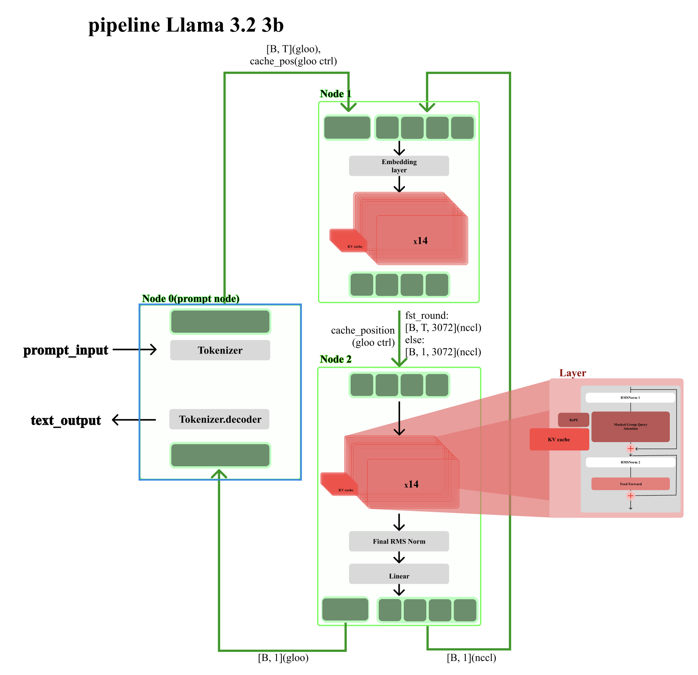

# Distributed LLM Inference with PyTorch Pipeline Parallelism

A pipeline-parallel inference system for **Llama-3.2-3B-Instruct** built on top of `torch.distributed`. The model is split across two worker processes and coordinated by a prompt-handling process, enabling LLM inference across multiple CPUs or GPUs.

---

## Architecture



Three processes (ranks) work together in a ring-like pipeline:

- **Node 0 (Prompt Node)** — Takes user input, tokenizes it, sends token IDs to Node 1, and decodes + prints the generated tokens received from Node 2.
- **Node 1 (Layer Node 1)** — Runs the first half of the model: the embedding layer and decoder layers 0–13. Receives token IDs from Node 0 and sends hidden states to Node 2.
- **Node 2 (Layer Node 2)** — Runs the second half of the model: decoder layers 14–27, final RMS norm, and the linear (lm_head) layer. Predicts the next token and sends it back to both Node 0 (for decoding) and Node 1 (for the next autoregressive step).

---

## File Structure

```
pipeline_project/
├── __main__.py        # Entry point; dispatches download or inference mode
├── division_model.py  # Split model definitions (Model1, Model2)
├── download.py        # Downloads, splits, verifies, and saves model weights
├── node.py            # Distributed node classes (PromptNode, LayerNode1, LayerNode2)
├── pipe.py            # Inter-process communication abstraction (Pipe layer)
├── buffer.py          # Async send/recv buffer pool
├── run_dist.py        # Distributed runtime initialization and node dispatch
├── parser.py          # CLI argument parser
└── test.py            # Prototype script for validating async communication
```

---

## File Descriptions

### `__main__.py`
The program entry point. Parses CLI arguments and branches into two modes:
- **`--download` flag present**: Downloads the model from HuggingFace Hub, splits it, and saves the two halves as `.safetensors` files.
- **No `--download` flag**: Initializes the distributed process group and starts inference via `run_main()`.

Global constants such as model repo ID, local paths, and the split index (`SPLIT_IDX = 14`) are defined here.

---

### `division_model.py`
Defines the two PyTorch modules that make up the split model.

| Class | Layers | Input | Output |
|---|---|---|---|
| `Model1` | Embedding + Decoder layers 0–13 | `input_ids` | `hidden_states`, `past_key_values` |
| `Model2` | Decoder layers 14–27 + RMSNorm + lm_head | `hidden_states` | `logits`, `hidden_states`, `past_key_values` |

`choose_attention_backend()` automatically selects the best available attention implementation: **Flash Attention 2** → **SDPA** → **Eager**, depending on the hardware.

Both models support **KV Cache** (`DynamicCache`) for efficient autoregressive generation.

---

### `download.py`
Handles model download, weight splitting, verification, and saving.

- **`split_llama_state_dict()`** — Splits the full model `state_dict` into two separate dictionaries for Model1 and Model2.
- **`check_state_dict_match()`** — Validates that the split weights exactly match the target model's architecture (no missing, unexpected, or shape-mismatched keys).
- **`verify_split_model()`** — Runs a forward pass through both the original and the split model and checks that their logits match numerically (`max_diff`).
- **`download_model()`** — Orchestrates the full pipeline: download → split → verify → save.

Saved output:
```
models/Llama-3.2-3B-Instruct-split/
├── model1.safetensors
├── model2.safetensors
├── config.json
├── tokenizer.json
└── split_meta.json
```

---

### `node.py`
Defines the three node classes, one per distributed rank.

#### `LLMPromptNode` (Rank 0)
- Reads user input from stdin and formats it using the Llama chat template.
- Tokenizes the prompt and sends `input_ids` to Rank 1.
- Receives generated next-tokens from Rank 2 and streams decoded text to stdout.
- Sends an `end` control signal to the pipeline when the user types `q`, `quit`, or `exit`.

#### `LLMLayerNode1` (Rank 1)
- Receives `input_ids` from Rank 0 and runs a forward pass through `Model1` (layers 0–13).
- Sends the resulting `hidden_states` to Rank 2.
- During autoregressive generation, receives `next_token` from Rank 2 and feeds it back into `Model1` using the KV cache.
- Manages two internal states: **prompt processing** (`state=True`) and **token generation** (`state=False`).

#### `LLMLayerNode2` (Rank 2)
- Receives `hidden_states` from Rank 1 and runs a forward pass through `Model2` (layers 14–27 + lm_head).
- Predicts the next token via argmax over the output logits.
- Detects EOS tokens and broadcasts an `eop` (end-of-prompt) signal to stop the current generation loop.
- Sends the predicted next-token to both Rank 0 (for printing) and Rank 1 (for the next forward pass).

---

### `pipe.py`
An inter-process communication abstraction layer built on `torch.distributed`.

Each pipe separates communication into a **control channel** and a **data channel**.

**Control layer:**

| Class | Role |
|---|---|
| `ControlSchema` | Encodes/decodes control messages (`end`, `eop`, `data`) as integer tensors |
| `ControlSender` | Sends control messages asynchronously via `isend` |
| `ControlReceiver` | Receives control messages asynchronously via `irecv` |

**Data channels:**

| Class | Use case |
|---|---|
| `FixedDataSender` / `FixedDataReceiver` | Tensors with a **known, fixed shape** (e.g., next_token, hidden_states during generation) |
| `DynamicDataSender` / `DynamicDataReceiver` | Tensors with a **variable shape** (e.g., input_ids during prompt processing); shape is embedded in the control message |

**Unified pipe:**

| Class | Role |
|---|---|
| `PipeSender` | Combines control + data send into a single `send(msg, data)` call |
| `PipeReceiver` | Receives the control message first, then conditionally receives data based on the `data` flag |

Use `PipeSender.fixed()` / `PipeSender.dynamic()` factory methods for easy construction.

---

### `buffer.py`
A **pre-allocated tensor buffer pool** for `torch.distributed` async communication.

| Class | Role |
|---|---|
| `Buffer_Send` | Maintains a pool of reusable tensors and dispatches `isend` calls. Blocks only when the in-flight queue is full. |
| `Buffer_Recv` | Pre-registers multiple `irecv` calls to keep the receive queue filled. Returns tensors in FIFO order. |

The key goal is to minimize memory allocation overhead and maximize communication/computation overlap.

---

### `run_dist.py`
Initializes the distributed environment and dispatches the correct node for each rank.

- Initializes `dist.init_process_group("gloo")` (with commented-out NCCL option for GPU-to-GPU hidden state transfer).
- **`load_model1()`** / **`load_model2()`** — Load weights from `.safetensors` and automatically set the best available attention backend.
- Automatically sets `model_device` to `cuda:0` if CUDA is available, otherwise falls back to `cpu`.
- Enforces `world_size == 3` and instantiates the appropriate node per rank.

---

### `parser.py`
Minimal CLI argument parser.

- `--download`: When present, runs the model download and splitting pipeline instead of inference.

---

### `test.py`
A standalone prototype script for validating the async `isend`/`irecv` communication pattern.

- Rank 0 sends N tensors using a sliding window of in-flight `isend` requests.
- Rank 1 pre-registers `irecv` calls and processes them in order.
- This script was used to validate the core idea behind `Buffer_Send` and `Buffer_Recv`.

---

## Getting Started

### 1. Install Dependencies

```bash
pip install torch transformers huggingface_hub safetensors
```

### 2. Download and Split the Model

```bash
torchrun --nproc_per_node=1 -m pipeline_project --download
```

### 3. Run Distributed Inference (3 processes)

```bash
torchrun --nproc_per_node=3 -m pipeline_project
```

After launching, type your prompt at `user:` and the model's response will stream to `llama:`. Type `q`, `quit`, or `exit` to stop.
